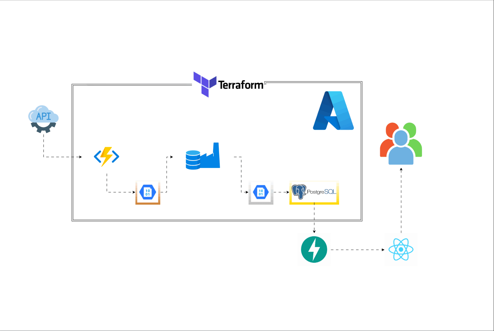
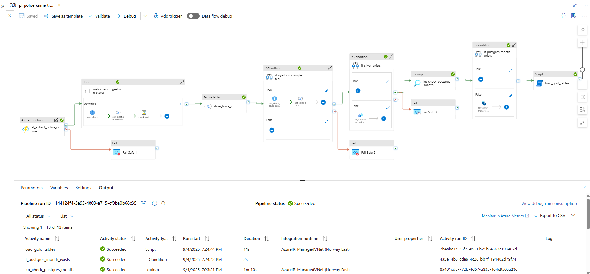
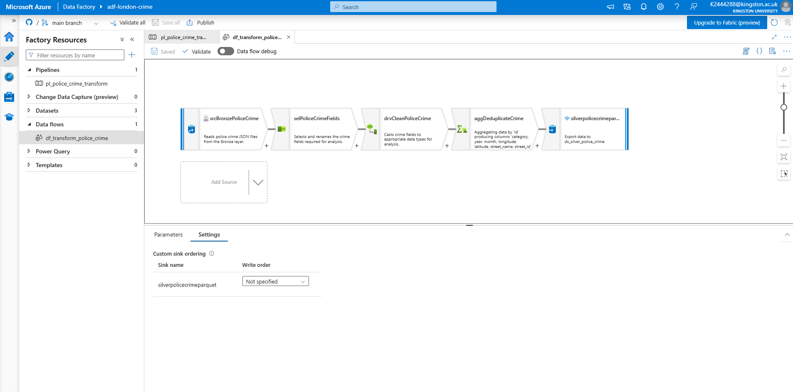
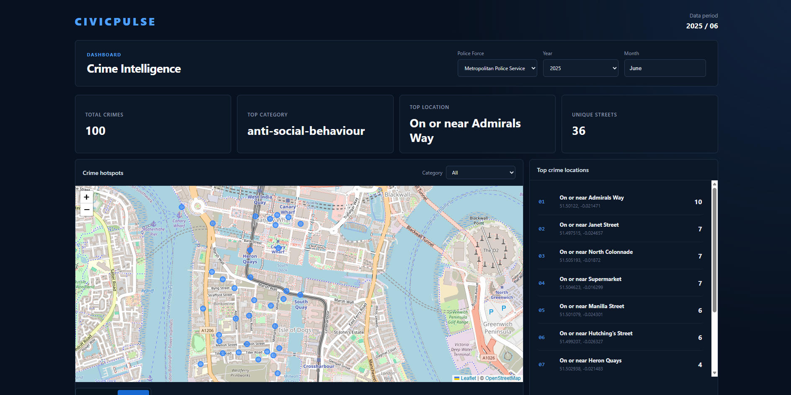
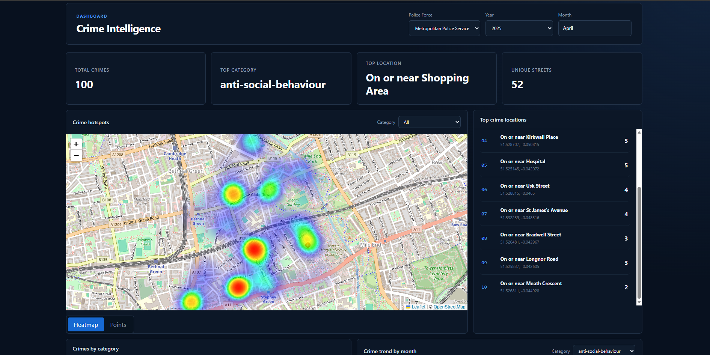
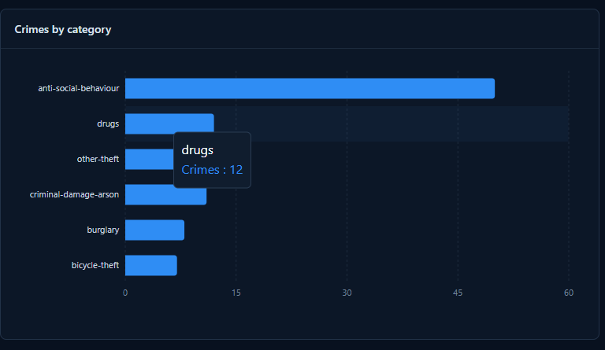
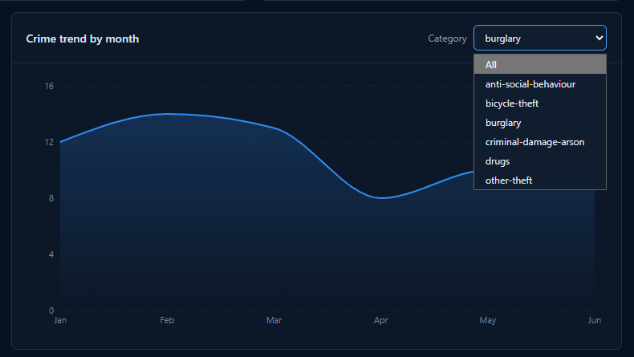

# Civic Pulse Urban City Service Request.


## PROJECT OVERVIEW
This project implements an end-to-end data engineering pipeline and API for monthly police crime reporting in London. The solution includes:
- Python extraction of raw JSON crime data from the UK Police API into Azure Blob Storage as the Bronze layer.
- Data validation and transformation using Azure Data Factory storing cleaned data in the Silver layer.
- Loading transformed data into Azure PostgreSQL Database serving as Gold layer for structured and query ready crime data.
- End-to-end pipeline orchestration using Azure Data Factory.
- A FastAPI backend for accessing processed crime data.
- Terraform for provisioning and managing Azure infrastructure.
- Automated testing and deployment using GitHub Actions for CI/CD.

## ARCHITECTURE


The architecture is built in Azure where a Durable Function runs the python extraction process to collect UK Police API data into Blob Storage. Azure Data Factory orchestrates the movement and transformation of data across the Bronze, silver and Gold layers. FastAPI connects to PostgreSQL and serves processed data to the React frontend for end-user requests.

### Extraction Pipeline
To retrieve crime data from the UK police API and store it in the **Bronze layer of Azure Blob Storage** required an engineered process of identifying a valid police force ID to retrieve the neighborhoods and boundaries coordinates covered by that force, the retrieved neighborhood boundary coordinate is then converted into the **polygon format** required by the Police force API for **location based** crime requests. 

The extraction includes retry and rate-limit handling. Neighborhood boundary requests are processed in batched of **15** while failed requests are retired up to 5 times. For **429 Too Many Requests** responses the process waits for the API provided **retry_after** value which is 30 seconds before retrying. Server errors are also retried before the request is treated as unsuccessful. The entry points of the ingestion pipeline is through an **Azure durable Function** which receives the police force, year and month on which the process is started and managed.

Extraction code follows the Single Responsibility Principle to segregate responsibilites:

| File                | Responsibility                                                                                                                   |
|---------------------|----------------------------------------------------------------------------------------------------------------------------------| 
| **`config.py`**     | This handles configuration, environments variable and logging.                                                                   | 
| **`extract.py`**    | Communicates the the Police API, handles neighborhood retrieval, boundary processing and crime extraction.                       | 
| **`az_storage.py`** | Handles Azure Blob Storage operations such as connection to storage, checking for existing data and uploading crime records.     | 
| **`Validation.py`** | validates schema/data and quarantine handling                                                                                    | 
| **`main.py`**       | coordinates the ingestion workflow                                                                                               |

### Transformation Pipeline

The pipeline is designed to ensure that the Gold layer is updated even when staging data already exists, orchestrating and transforming the crime data from the bronze layer into analytics data.
Process involves:
- Check if the required Bronze and Silver data already exists.
- Run an ADF Mapping Data Flow to flatten, clean and deduplicate the raw JSON data.
- Store the transformed data in the Silver layer as Parquet files.
- Check if the selected month already exists in PostgreSQL.
- Load new Silver data into the PostgreSQL staging table when required.
- Execute the Gold loading process to populate the dimension and fact tables.




#### Bronze to Silver Transformation
ADF Mapping Data Flow transforms the data from the Bronze layer into structured Silver dataset.
Process involves:
- Select the required crime firled from the raw JSON.
- Clean and standardise the data.
- Remove duplicate crime records.
- Write the transformed data to the Silver layer in Parquet format.




### API & Frontend Integration

FastAPI connects the web application to the PostgreSQL Gold layer and exposes crime data through API endpoints. The React + Vite frontend consumes these endpoints to provide an interactive interface for exploring monthly Police crime data.

The dashboard supports:
- Filtering crime data by year and month.
- Viewing total crimes, top crime category, top location and unique streets.
- Interactive crime hotspot visualisation using heatmap and point views.
- Crime distribution by category.
- Monthly crime trend analysis with category filtering.


### Crime Intelligence Dashboard

The dashboard provides an overview of crime activity for the selected reporting period, including key metrics, hotspot locations and the highest crime locations.




### Crime Hotspot Analysis

Crime locations can be explored using either a heatmap or individual crime location points, allowing areas with higher crime concentration to be identified visually.




### Crime Category Distribution

Crime records are grouped by category to show the distribution of reported crime types for the selected period.




### Monthly Crime Trends

Monthly trends can be analysed across the available reporting period and filtered by individual crime categories.




## TECHNOLOGY STACK
- Python
- Azure Functions/ Durable Functions
- Azure Data Lake Storage Gen2
- Azure Data Factory (ADF)
- PostgreSQL
- Terraform
- FastAPI
- React + Vite


## REPOSITORY STRUCTURE
```text
.
├── .github/workflows/     # CI/CD pipelines
├── adf/                   # Azure Data Factory definitions
├── img/                   # Architecture diagrams
├── src/
│   ├── ingestion/         # API extraction, validation and storage logic
│   └── web_app/           # FastAPI backend and React frontend
├── terraform/             # Azure infrastructure as code
├── tests/                 # Data validation tests
├── function_app.py        # Azure Durable Function entry point
├── host.json              # Azure Functions configuration
├── requirements.txt       # Python dependencies
└── README.md              # Project documentation

```


